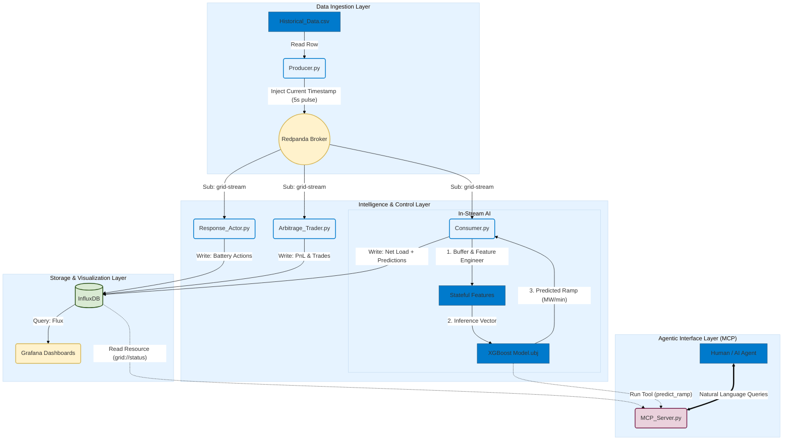

# SmartGrid-AI: Predictive Resilience & Arbitrage Platform

[](https://github.com/dvouna/grid_twin_virtual_power_plant-/actions)
[](https://github.com/dvouna/grid_twin_virtual_power_plant-/actions)
[](https://codecov.io/gh/dvouna/grid_twin_virtual_power_plant-)
[](https://www.python.org/)
[](https://www.docker.com/)
[](#b-system-architecture)
[](#e-getting-started)
[](https://opensource.org/licenses/MIT)

SmartGrid‑AI is an intelligent virtual power plant (VPP) platform that transforms raw grid telemetry into real‑time operational decisions. It blends streaming ingestion, stateful feature engineering, predictive modeling, and autonomous control agents to stabilize the grid and optimize economic outcomes.

## A. Core Capabilities

### 1. Real-Time Grid Intelligence

- Continuous ingestion of Net Load, Solar Generation, and related telemetry.
- Stateful feature engineering with temporal lags, rolling statistics, and interaction terms.
- Predictive modeling to detect instability, ramps, and arbitrage opportunities.

### 2. MCP-Driven Decision Engine ("The Brain")

Hosted on an MCP server, the SmartGrid‑AI agent can:

- Forecast short‑term load changes.
- Trigger resilience actions (e.g., dispatch peakers or batteries).
- Execute arbitrage strategies (buy low, sell high).
- Reason over grid state and call tools autonomously.

### 3. Autonomous Control Agents

- **Grid Response Actor**: Detects instability events and dispatches assets to maintain frequency and avoid penalties.
- **Arbitrage Trader**: Executes charge/discharge cycles based on predicted price differentials.

## B. System Architecture

### 1. High-Level Flow

```text
Module Purpose 
   → [InfluxDB] 
   → [Feature Store] 
   → [MCP Agent] 
   → [Response & Trading Agents] 
   → [Grid Output]
```

### 2. Detailed microservices Architecture



## C. Feature Engineering: The Stateful Intelligence Layer

Real‑time grid data is noisy and insufficient on its own. The platform uses a stateful feature pipeline to transform raw telemetry into a rich predictive feature space.

### 1. Cyclical Time Encoding

To preserve the circular nature of time, we transform hourly data using sine and cosine encodings:
$$\text{Hour}_{sin} = \sin\left(\frac{2\pi \cdot \text{Hour}}{24}\right)$$
$$\text{Hour}_{cos} = \cos\left(\frac{2\pi \cdot \text{Hour}}{24}\right)$$

### 2. Temporal Lags

A rolling buffer (Python deque) maintains the last 50 observations:

- $L_{t-1}$ to $L_{t-12}$ capture short‑term momentum.
- Enables autoregressive reasoning about ramps and volatility.

### 3. Rolling Window Statistics

Used to smooth transient spikes:

- Rolling mean (baseline trend).
- Rolling standard deviation (local volatility).

### 4. Grid Interaction Features

Captures non‑linear system behavior:

- Renewable Penetration Ratio: $\frac{Solar + Wind}{Gross Load}$
- Net Load Gradient: Instantaneous rate of change.

## D. Technical Stack

| Layer | Technology |
| :--- | :--- |
| **Streaming** | Redpanda (Kafka-compatible) |
| **Storage** | InfluxDB (time-series) |
| **AI/ML** | XGBoost, Scikit-Learn, Pandas |
| **Control** | Python Agents |
| **Communication** | MCP (Model Context Protocol) |
| **Visualization** | Grafana |
| **Virtualization** | Docker, Docker Compose, GitHub Actions |

## E. Getting Started

### 1. Prerequisites

- Python 3.8+
- InfluxDB running locally or remotely.
- Redpanda/Kafka (optional, for streaming pipeline).

### 2. Installation

```bash
git clone https://github.com/dvouna/grid_twin_virtual_power_plant-
cd grid_twin_virtual_power_plant-
pip install -r requirements.txt
```

### 3. Project Structure

```text
src/vpp/
├── intelligence/    # Data streaming and ML pipeline
│   ├── producer.py
│   ├── consumer.py
│   ├── feature_engineering.py
│   └── xgboost.py
├── agents/          # Autonomous control agents
│   ├── grid_agent.py
│   ├── grid_response_actor.py
│   └── arbitrage_trader.py
└── mcp/             # MCP Server and Intelligence interface
    └── mcp_server.py
```

## F. Running the System

To run the modules correctly, ensure `src` is in your `PYTHONPATH`.

### 1. Start the Brain (MCP Server)

```powershell
# Windows
$env:PYTHONPATH="src"; python src/vpp/mcp/mcp_server.py
```

### 2. Start Autonomous Agents

```powershell
# Grid Response Actor
$env:PYTHONPATH="src"; python -m vpp.agents.grid_response_actor

# Arbitrage Trader
$env:PYTHONPATH="src"; python -m vpp.agents.arbitrage_trader

# Autonomous Grid Agent
$env:PYTHONPATH="src"; python -m vpp.agents.grid_agent
```

### 3. Run the Intelligence Pipeline

```powershell
$env:PYTHONPATH="src"; python -m vpp.intelligence.producer
$env:PYTHONPATH="src"; python -m vpp.intelligence.consumer
```

## G. Future Roadmap

- **Cloud Evolution**: Migration to AWS MSK for managed streaming and Lambda for serverless inference.
- **Cybersecurity**: Implementation of False Data Injection Attack (FDIA) detection using predictive residuals.
- **Cognitive Ops (RAG)**: Integrating Retrieval-Augmented Generation to allow the AI agent to cross-reference grid actions with NERC/FERC regulatory manuals.
