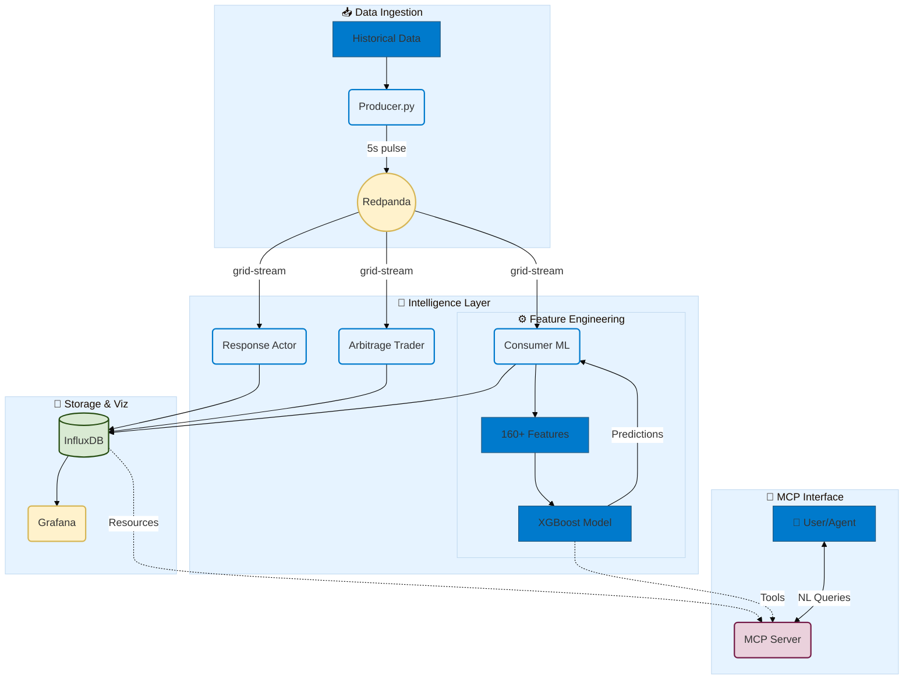
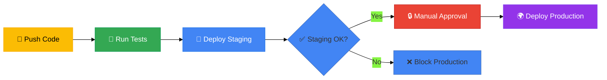

<div align="center">

# ⚡ SmartGrid-AI

### *Intelligent Virtual Power Plant Platform*

**Real-time grid intelligence powered by ML, streaming data, and autonomous agents**

[](https://github.com/dvouna/grid_twin_virtual_power_plant-/actions)
[](https://www.python.org/)
[](https://cloud.google.com/run)
[](LICENSE)
[](#-system-architecture)

[Features](#-key-features) • [Architecture](#-system-architecture) • [Quick Start](#-quick-start) • [Documentation](#-technical-deep-dive) • [Roadmap](#-roadmap)

</div>

---

## 🎯 Overview

SmartGrid-AI is a production-ready **Virtual Power Plant (VPP)** platform that transforms raw grid telemetry into intelligent, real-time operational decisions. By combining streaming data ingestion, stateful feature engineering, predictive ML models, and autonomous control agents, it enables:

- **Grid Stabilization** – Detect and respond to frequency instabilities in real-time
- **Economic Optimization** – Execute energy arbitrage strategies (buy low, sell high)
- **Predictive Intelligence** – Forecast load ramps and renewable generation patterns
- **Autonomous Operations** – AI agents that reason over grid state and take action

---

## ✨ Key Features

<table>
<tr>
<td width="50%">

### 🧠 **AI-Powered Decision Engine**

- MCP-based "brain" hosted on Cloud Run
- Natural language interface via Claude Desktop
- Autonomous reasoning and tool execution
- Real-time load forecasting and anomaly detection

</td>
<td width="50%">

### 📊 **Real-Time Intelligence**

- Streaming ingestion from Redpanda/Kafka
- Stateful feature engineering (160+ features)
- XGBoost predictive models
- InfluxDB time-series storage

</td>
</tr>
<tr>
<td width="50%">

### 🤖 **Autonomous Agents**

- **Grid Response Actor** – Dispatch batteries to stabilize frequency
- **Arbitrage Trader** – Execute charge/discharge cycles for profit
- **Predictive Consumer** – ML-driven load forecasting

</td>
<td width="50%">

### 🚀 **Production-Grade Infrastructure**

- Multi-environment CI/CD (staging → production)
- Workload Identity Federation (WIF) security
- Secret management via GCP Secret Manager
- Automated health checks and rollbacks

</td>
</tr>
</table>

---

## 🏗️ System Architecture

### High-Level Data Flow


### Microservices Architecture



---

## 🚀 Quick Start

### Prerequisites

- **Python 3.11+**
- **InfluxDB** (local or cloud)
- **Redpanda/Kafka** (optional, for streaming)
- **GCP Account** (for Cloud Run deployment)

### Installation

```bash
# Clone the repository
git clone https://github.com/dvouna/grid_twin_virtual_power_plant-.git
cd grid_twin_virtual_power_plant-

# Create virtual environment
python -m venv .venv
source .venv/bin/activate  # On Windows: .venv\Scripts\activate

# Install dependencies
pip install -r requirements.txt
```

### Running Locally

```powershell
# 1. Start the MCP Server (The Brain)
$env:PYTHONPATH="src"
python src/vpp/mcp/mcp_server.py

# 2. Start Autonomous Agents (in separate terminals)
python -m vpp.agents.grid_response_actor
python -m vpp.agents.arbitrage_trader

# 3. Start Data Pipeline
python -m vpp.intelligence.producer
python -m vpp.intelligence.consumer
```

### Deploying to Cloud Run

The project includes a production-ready CI/CD pipeline:

1. **Push to `develop`** → Auto-deploys to **staging**
2. **Merge to `main`** → Deploys to **staging** → **production** (with approval)

```bash
# Trigger deployment
git push origin develop  # Staging
git push origin main     # Production (after staging validation)
```

---

## 📁 Project Structure

```
grid_twin_virtual_power_plant-/
├── .github/workflows/       # CI/CD pipelines
│   └── deploy-cloud-run.yml
├── src/vpp/
│   ├── intelligence/        # ML & streaming pipeline
│   │   ├── producer.py      # Data ingestion
│   │   ├── consumer_ml.py   # ML inference consumer
│   │   └── GridFeatureStore.py  # Feature engineering
│   ├── agents/              # Autonomous control agents
│   │   ├── grid_response_actor.py
│   │   └── arbitrage_trader.py
│   └── mcp/                 # MCP server (the "brain")
│       └── mcp_server.py
├── tests/                   # Unit & integration tests
├── models/                  # Trained ML models
├── data/                    # Historical grid data
├── Dockerfile               # Container definition
└── requirements.txt         # Python dependencies
```

---

## 🔬 Technical Deep Dive

### Feature Engineering Pipeline

SmartGrid-AI transforms raw telemetry into **160+ engineered features** using:

#### 1. **Cyclical Time Encoding**

Preserves temporal periodicity:
$$\text{Hour}_{sin} = \sin\left(\frac{2\pi \cdot \text{Hour}}{24}\right), \quad \text{Hour}_{cos} = \cos\left(\frac{2\pi \cdot \text{Hour}}{24}\right)$$

#### 2. **Temporal Lags**

Rolling buffer (50 observations) captures momentum:

- $L_{t-1}$ to $L_{t-12}$ for short-term patterns
- Enables autoregressive forecasting

#### 3. **Rolling Statistics**

- **Mean** – Baseline trend
- **Std Dev** – Local volatility

#### 4. **Grid Interaction Features**

- **Renewable Penetration**: $\frac{\text{Solar} + \text{Wind}}{\text{Gross Load}}$
- **Net Load Gradient**: Instantaneous rate of change

### Technology Stack

| **Category** | **Technology** |
|:-------------|:---------------|
| **Streaming** | Redpanda (Kafka-compatible) |
| **Data Bridge** | Redpanda Connect (Benthos) |
| **Cloud Platform** | Google Cloud Run (Serverless) |
| **Compute** | Google Compute Engine (VMs) |
| **Security** | Workload Identity Federation, Secret Manager |
| **Storage** | InfluxDB Cloud (Time-Series DB) |
| **ML/AI** | XGBoost, Scikit-Learn, FastMCP |
| **CI/CD** | GitHub Actions |
| **Monitoring** | Grafana, Cloud Logging |

---

## 🧪 Testing

```bash
# Run unit tests (excludes integration tests)
pytest -m "not integration" -v

# Run linter
ruff check src/ tests/ --output-format=github

# Run all tests (requires Redpanda + InfluxDB)
pytest -v
```

---

## 📊 CI/CD Pipeline

The project implements a **staging-before-production** deployment strategy:



**Key Features:**

- ✅ Automated testing (linting + unit tests)
- ✅ Staging validation before production
- ✅ Manual approval gates
- ✅ Health checks and rollback capability
- ✅ Workload Identity Federation (no service account keys)

---

## 🗺️ Roadmap

### 🔜 Near-Term

- [ ] **Enhanced Monitoring** – Prometheus metrics + alerting
- [ ] **Load Testing** – Stress test MCP server under high query load
- [ ] **Multi-Region Deployment** – HA across GCP regions

### 🔮 Future Vision

- [ ] **Digital Twin Integration** – Physics-based grid simulation
- [ ] **Cybersecurity Module** – False Data Injection Attack (FDIA) detection
- [ ] **Cognitive Ops (RAG)** – AI agent cross-references NERC/FERC regulations
- [ ] **Federated Learning** – Privacy-preserving multi-utility collaboration

---

## 🤝 Contributing

Contributions are welcome! Please:

1. Fork the repository
2. Create a feature branch (`git checkout -b feature/amazing-feature`)
3. Commit your changes (`git commit -m 'Add amazing feature'`)
4. Push to the branch (`git push origin feature/amazing-feature`)
5. Open a Pull Request

---

## 📄 License

This project is licensed under the MIT License - see the [LICENSE](LICENSE) file for details.

---

## 🙏 Acknowledgments

- **Google Cloud Platform** – Cloud Run, Secret Manager, Workload Identity
- **Redpanda** – High-performance streaming platform
- **InfluxDB** – Time-series database
- **Anthropic** – Claude AI and MCP protocol
- **XGBoost** – Gradient boosting framework

---

<div align="center">

**Built with ❤️ for a smarter, more resilient grid**

[⬆ Back to Top](#-smartgrid-ai)

</div>
